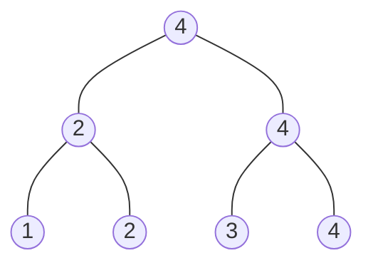

算法分析
========

在很多情况下，描述一个算法的运行时间是有用的，为此，需要定义一套统一的算法渐进记号来合适的描述算法的运行效率。然后我们通过各种方法对不同的算法运行效率进行分析。

<!-- more -->

算法时间复杂度记号
=================

$\Theta$ 渐进紧确界
---------------------

>定义一：设$f(n)$和$g(n)$是定义域为自然数集合的函数。如果$\lim_{n \rightarrow \infty}\frac{f(n)}{g(n)}$存在，并且等于某个常数$c(c>0)$，那么$f(n)=\Theta(g(n))$。通俗理解为$f(n)$和$g(n)$同阶，$\Theta$用来表示算法的精确阶。

$$
\Theta(g(n)) = \{ f(n):\lim_{n \rightarrow \infty}\frac{f(n)}{g(n)} = c | c>0 \}
$$

>定义二：若存在正常量$c_1$、$c_2$，使得对于足够大的$n$，函数$f(n)$能“夹入”$c_1g(n)$与$c_2g(n)$之间，则$f(n)$属于集合$\Theta(g(n))$，记作$f(n) \in \Theta(g(n))$。作为代替，我们通常记“$f(n)=\Theta(g(n))$”。

$$
\Theta(g(n)) = \{ f(n):\exists c_1,c_2,n_0,\forall n \ge n_0,0 \le c_1g(n) \le f(n) \le c_2g(n) \}
$$

$O$ 渐进上界
-------------

>定义：设$f(n)$和$g(n)$是定义域为自然数集$N$上的函数。若存在正数$c$和$n_0$，使得对一切$n \ge n_0$都有$0 \le f(n) \le cg(n)$成立，则称$f(n)$的渐进的上界是$g(n)$，记作$f(n)=O(g(n))$。通俗的说n满足一定条件范围内，函数$f(n)$的阶不高于函数$g(n)$。

$$
O(g(n)) = \{ f(n):\exists c,n_0,\forall n \ge n_0,0 \le f(n) \le cg(n) \}
$$

  例如：设$f(n)=n^2+n$,则
  $f(n)=O(n^2)$，取$c=2$,$n_0=1$即可
  $f(n)=O(n^3)$，取$c=1$,$n_0=2$即可。显然，O(n^2)作为上界更为精确。

$o$ 非渐进紧确上界
----------------

>定义1：设$f(n)$和$g(n)$是定义域为自然数集N上的函数。若对于任意正数$c$，都存在$n_0$，使得对一切$n≥n_0$都有$0 \le f(n)<cg(n)$成立，则称$f(n)$的渐进的非紧确上界是$g(n)$，记作$f(n)=o(g(n))$。通俗的说$n$满足一定条件范围内，函数$f(n)$的阶低于函数$g(n)$。

$$
o(g(n)) = \{f(n):\forall c,\exists n_0,\forall n \ge n_0,0 \le f(n) < cg(n) \}
$$

>定义2：设$f(n)$和$g(n)$是定义域为自然数集合的函数。如果$lim_{n\rightarrow \infty}\frac{f(n)}{g(n)}=0$，那么$f(n)=o(g(n))$。通俗理解为$f(n)$低于$g(n)$的阶。

$$
o(g(n)) = \{ f(n):\lim_{n \rightarrow \infty}\frac{f(n)}{g(n)} = 0 \}
$$

  由O记号提供的渐近上界可能是渐近紧确的，也可能是非紧确的。
    如：$2n^2=O(n^2)$是渐近紧确的，而$2n=O(n^2)$是非紧确上界。

  例子：$f(n)=n^2+n$，则$f(n)=o(n^3)$

$\Omega$ 渐进下界
-------------------

>定义：设$f(n)$和$g(n)$是定义域为自然数集$N$上的函数。若存在正数$c$和$n_0$，使得对一切$n≥n_0$都有$0≤cg(n)≤f(n)$成立，则称$f(n)$的渐进的下界是$g(n)$，记作$f(n)=\Omega(g(n))$。通俗的说n满足一定条件范围内，函数$f(n)$的阶不低于函数$g(n)$。

$$
\Omega(g(n)) = \{ f(n):\exists c,n_0,\forall n \ge n_0,0 \le cg(n) \le f(n) \}
$$

$\omega$ 非渐进紧确下界
----------------------

>定义1：设$f(n)$和$g(n)$是定义域为自然数集N上的函数。若对于任意正数$c$，都存在$n_0$，使得对一切$n \ge n_0$都有$0 \le cg(n) < f(n)$成立，则称$f(n)$的渐进的非紧确下界是$g(n)$，记作$f(n)= \omega (g(n))$。通俗的说$n$满足一定条件范围内，函数$f(n)$的阶高于函数$g(n)$。

$$
\omega(g(n)) = \{ f(n):\forall c, \exists n_0,\forall n \ge n_0,0 \le cg(n) \le f(n) \}
$$

>定义2：设$f(n)$和$g(n)$是定义域为自然数集合的函数。如果$\lim_{n\rightarrow \infty}\frac{f(n)}{g(n)}=\infty$，那么$f(n)=o(g(n))$。通俗理解为$f(n)$高于$g(n)$的阶。

$$
\omega(g(n)) = \{ f(n):\lim_{n \rightarrow \infty} \frac{f(n)}{g(n)} = \infty \}
$$

符号总结
-----------

| 记号     | 含义           | 通俗理解 |
| :------: | :------------: | :------: |
| $\Theta$ | 渐进紧确界     | =        |
| $O$      | 渐进上界       | $\le$    |
| $o$      | 非紧的渐进上界 | <        |
| $\Omega$ | 渐进下界       | $\ge$    |
| $\omega$ | 非紧的渐进下界 | >        |

+ 传递性: 所有五个标记
  + $f(n)= \Theta(g(n))$且$g(n)= \Theta(h(n))\rightarrow f(n)= \Theta(h(n))$
+ 自反性: O、$\Theta$、$\Omega$
  + $f(n)= \Theta(f(n))$
+ 对称性: $\Omega$
  + $f(n)= \Theta(g(n))$ 当且仅当$g(n)= \Theta(f(n))$
+ 反对称性:
  + $f(n) = O(g(n))$当且仅当 $g(n)= \Omega(f(n))$
  + $f(n) = o(g(n))$当且仅当 $g(n)= \omega(f(n))$

一些典型的增长阶：
$$
O(1) < O(\lg n) < O(\sqrt n) < O(n) < O(n \lg n) < O(n^2) < O(n^3) < O(2^n) < O(n!)
$$

和式的估计与界限
================

和式的估计
--------------

$$
\sum_{k=1}^n(ca_k+b_k) = c\sum_{k=1}^na_k+\sum_{k=1}^nb_k
$$

$$
\sum_{t=1}^ni=\frac{n(n+1)}{2} = \theta(n^2)
$$

$$
\sum_{k=1}^nx^k = 1+x+x^2+ \dots + x^n = \frac{x^{n+1}-1}{x-1} \qquad x \not= 1
$$

$$
\sum_{k=0}^{\infty} x^k = \frac{1}{1-x} \qquad |x|<1
$$

$$
H_n = \sum_{k=1}^n\frac{1}{k} = \ln n+ O(1)
$$

递归方程
-------------

>递归方程：递归方程是使用小的输入值来描述一个函数的方程或者不等是。

$$
T(n)=\left\{
  \begin{array}{ll}
  \Theta (1) & if \quad n = 1 \\
  2T(\frac{n}{2}) + \Theta(n) & if \quad n \ge 1
  \end{array} \right.
$$

$$
T(n) = \Theta(n \log n)
$$

求解递归方程的三个主要方法：

+ 替换方法
  1. 首先猜想
  2. 然后用数学归纳法证明
+ 迭代方法
  1. 把方程转化为一个和式
  2. 然后用估计和的方法来求解
+ Master定理
  + 求解型为$T(n)=aT(\frac{n}{b})+f(n)$的递归方程

Master定理
-----------

>Master定理：设$a \ge 1$和$b>1$是常数，$f(n)$是一个函数，$T(n)$是定义在非负整数级上的函数$T(n)=aT(\frac{n}{b})+f(n)$，$T(n)$可以如下求解：

1. 若$f(n) = O(n^{\log_b a-\epsilon})$，$\epsilon > 0$是常数，则$T(n) = \theta(n^{\log_b a})$
2. 若$f(n) = O(n^{\log_b a})$，则$T(n) = \theta(n^{\log_b a}\lg n)$
3. 若$f(n) = \Omega(n^{\log_b a + \epsilon})$，$\epsilon > 0$是常数，且对于所有充分大的$n$有$af(\frac{n}{b}) \le cf(n)$,$c < 1$是常数，则$T(n) = \theta(f(n))$

换言之，我们比较$f(n)$和$n^{\log_b a}$：

1. 则$n^{\log_b a}$大，$T(n) = \theta(n^{\log_b a})$
2. 若$f(n)$大，则$T(n) = \theta(f(n))$
3. 若$f(n)$与$n^{\log_b a}$同阶，$T(n) = \theta(n^{\log_b a}\lg n) = \theta(n^{\log_b a}\lg n)$

摊还分析
======

聚集法
-----

对所有可能的操作情况进行累加，而后求取平均值。

会计法
-----

对不同的操作给定代价和存款，我们每次对操作进行支付，支付的代价余额可以存储，不够支付当前操作代价的时候可以使用存款进行支付。

势能法
-----

在会计方法中,如果操作的平摊代价比实际代价大,我们将余额与具体的数据对象关联如果我们将这些余额都与整个数据结构关联,所有的这样的余额之和,构成——数据结构的势能如果操作的平摊代价大于操作的实际代价-势能增加如果操作的平摊代价小于操作的实际代价,要用数据结构的势能来支付实际代价-势能减少。

习题
=========

>求解递归方程$T(n) = T(\frac{5n}{6}) + n$

1. $a = 1$,$b = \frac{6}{5}$,$f(n) = n$
2. $n^{\log_ba} = 1 < f(n)$
3. $T(n) = \Theta(n)$

>证明或否证明$f(n) + o(f(n)) = \theta(f(n))$

$$
\begin{array}{ll}
\lim_{n \rightarrow \infty}\frac{\theta(f(n))}{f(n) + o(f(n))} &= \lim_{n \rightarrow \infty}\frac{1}{\frac{f(n)}{\theta(f(n))} + \frac{o(f(n))}{\theta(f(n))}} \\
  &= \lim_{n \rightarrow \infty}\frac{1}{\frac{1}{c} + 0} \\
  &= c
\end{array}
$$

>证明：设k是任意常数正整数，则$\log^kn = o(n)$

$$
\begin{array}{ll}
\lim_{n \rightarrow \infty}\frac{\log^kn}{n} &= \lim_{n \rightarrow \infty}\frac{k\log^{k-1}n}{n} \\
&= \lim_{n \rightarrow \infty}\frac{k(k-1)\log^{k-2}n}{n} \\
&= \lim_{n \rightarrow \infty}\frac{k!}{n} \\
&= 0
\end{array}
$$

>证明$O(f(x))+O(g(x))=O(max(f(x),g(x)))$

$$
\begin{gathered}
   f(x) \le \max(f(x),g(x)) \\
   g(x) \le \max(f(x),g(x)) \\
   f(x) + g(x) \le 2\max(f(x),g(x))
\end{gathered}
$$

满足定义，所以$O(f(x)+g(x)) = O(\max(f(x),g(x)))$得证。

>求解递归方程$T(n)=T(\lceil \frac{n}{2} \rceil) + 1$,$\lceil x \rceil$用以表示不小于x的整数中最小的一个。

$$
\begin{aligned}
T(n) & = T(\lceil \frac{n}{2} \rceil) + 1\\
     & = T(\lceil \frac{\lceil \frac{n}{2} \rceil}{2} \rceil) + 2 \\
     & = \lceil \log_2n \rceil = O(\log n)
\end{aligned}
$$

>对于平面上的两个点$p_1=(x_1, y_1)$和$p_2=(x_2,y_2)$，如果$x_1 \le x_2$且$y_1 \le y_2$，则$p_2$支配$p_1$，给定平面上的$n$个点，请设计算法求其中没有被任何其他点支配的点。


设x坐标最大的点为$p_x(x_1,y_1)$，y坐标最大的点为$p_y(x_2,y_2)$，显然$p_x,p_y$没有被支配，而$x < x_2$或者$y < y_1$的点都被二者中的一个支配，右上角的点没有被这两点支配，将这两点拿掉，我们可以对剩余的点递归的进行同样的操作。

感谢@TOM的建议，有一种更快的方案，可以这样做，按照x坐标优先的方式进行从大到小排序，而后维护一个当前的最大y值，大于当前最大y值的点则没有被支配，可以加入进去，然后更新最大y值，示意图就不画了。

```c++
bool cmp(const point &lhs, const point &rhs) {
    if (rhs.x < lhs.x)
        return true;
    if (lhs.x < rhs.x)
        return false;
    return rhs.y < lhs.y;
}

std::vector<point> find_no_dominated(const std::vector<point> &points) {
    int y_max = 0;
    std::vector<point> sorted = points;
    sort(sorted.begin(), sorted.end(), cmp);
    std::vector<point> res;
    for (point p:sorted) {
        if (p.y >= y_max) {
            res.push_back(p);
            y_max = p.y;
        }
    }
    return res;
}
```

>如果一个数组$A[1…n]$中某个元素的数量超过其元素数量的一半，称其包含主元素，假设比较两个元素大小的时间不是常数但判定两个元素是否相等的时间是常数，要求对于给定数组$A$，设计算法判定其是否有主元素，如果有，找到该元素。
>(1)设计时间复杂性为$O(n \log n)$的算法完成该任务。
>(2)设计时间复杂性为$O(n)$的算法完成该任务。

(1) ~~快速排序，而后遍历，时间复杂度为O(n*log*n)(比较不是常数时间)。~~参考@高靖龙的算法，把数组分成两个数组A,B,若A和B的主元素分别是a,b，那么主元素m必定是a或者b，然后使用遍历的方法就可以确定主元素是谁。

```c
int find_master(const int A[], int start, int end) {
    if (start + 1 == end)
        return start;

    int middle = (start + end) / 2;
    int a = find_master(A, start, middle);
    int b = find_master(A, middle, end);

    int middle_size = (end - start) / 2;

    int count_a = 0;
    int count_b = 0;
    for (int i = start; i != end; ++i) {
        count_a += A[i] == A[a];
        count_b += A[i] == A[b];
        if (count_a > middle_size) return a;
        if (count_b > middle_size) return b;
    }
    return -1;
}

int find_master(const int A[], int size) {
    return find_master_log_n(A, 0, size);
}
```

(2) 若某个元素的个数超过总元素个数的一半，那么两两不同的元素抵消，那么最终剩下的元素一定是主元素。

```c
int find_master(const int A[], int size) {
    int master = 0, count = 1;
    for (int i = 1; i != size; ++i) {
        count += A[i] == A[master] ? 1 : -1;
        if (count == 0) {
            master = i;
            count = 1;
        }
    }
    count = 0;
    for (int i = 0; i != size; ++i)
        if (A[master] == A[i])count++;
    return count > size / 2 ? master : -1;
}
```

----------------------------------------
这里给出的都是数组的下标。

>证明：在有$n$个数的序列中找出最大的数至少需要$n-1$次比较

类似比赛晋级，两两配对比较，赢的再两两配对，最后得到冠军(最大的数)，可以看成是一棵二叉树，以4个数为例：



容易看出，找出最大的数比较次数是n-1。事实上只要二叉树的叶节点的个数为n，它的非叶节点数都是n-1,也就是说，无论如何比较，只要每个节点都要被比较到，最小比较次数总是为n-1,。

>设计一个对7个元素进行排序的方法，保证其平均比较次数最少，要求证明这个结论

7个元素的排序决策树的节点一共有7!个。那么排序的决策树树高至少为$h \ge \log_2(7!) \approx 12.2$，所以至少要比较13次。

考虑对3个元素排序，至少需要几次比较？答案是3次。但是如果有4个元素，要求对其中的3个元素建立全序关系，至少需要几次比较呢？答案仍然是3次。方法如下。假设有四个元素a、b、c、d。如下图所示，在a和b之间进行一次比较，在c和d之间进行一次比较，将这两次比较中较大的元素再进行一次比较，则至少有3个元素能够确定全序关系。

现在，我们仅通过3次比较，不仅得出了3个元素的全序关系，还知道另外一个元素与这3个元素中的一个元素的序关系。

假设有7个元素：a、b、c、d、e、f、g。

首先，我们使用3次比较，确定3个元素的全序关系，并且还额外的知道了另外一个元素与这3个元素中的一个元素的序关系。例如：a < b < c且a < d。

接着，我们使用折半查找将e插入到已序序列a、b、c中，至多需要2次比较。然后得到已序序列a、b、c、e。

由于最开始我们已经知道了剩下的未排序元素与已序序列中一个元素的序关系，因此至少可以排除掉一个元素。相当于将剩下的未排序元素插入到一个长度为3的已序序列，至多需要2次比较。例如将d插入到已序序列a、b、c、e中，已知a < d，则只需考虑将d插入到已序序列b、c、e中。

至多需要7次比较，即可完成5个元素的排序，而后我们将剩下的2个元素f、g插入其中，使用二分插入，至多比较6次。

综上，对7个元素进行排序，至多需要13次比较。

>假设$a_1,a_2,\dots,a_n$是$\{1,2,\dots,n\}$的一个随机排列，等可能的为$n!$可能排列中的任意一种排列，当对列表$a_1,a_2,\dots,a_n$排序时，元素$a_i$从它当前位置到达排序位置必须移动$|a_i-i|$的距离，求元素必须移动的期望总距离$E\sum_{i=1}^n[|a_i-1|]$

解：