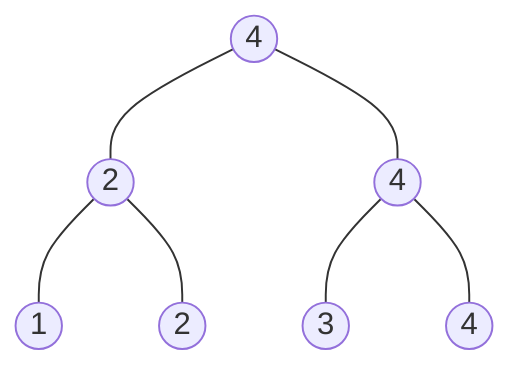

# 分治法的设计

+ 划分：整个问题划分成为多个子问题
+ 求解：求解各个子问题（递归调用正在设计的算法）
+ 合并：合并子问题的解，形成原始问题的解

<!-- more -->

# 分治算法的分析

分析过程：

+ 求解递归方程
+ 求解

递归方程的建立方法：

+ 当输入大小为n，$T(n)$为时间复杂度
+ 当$n<c$，$T(n)=\theta(1)$

+ 划分阶段的时间复杂性
  + 划分问题为$a$个子问题。
  + 每个子问题大小为$\frac{n}{b}$。
  + 划分时间可直接得到=$D(n)$
+ 递归求解阶段的时间复杂性
  + 递归调用
  + 求解时间= $aT(\frac{n}{b})$
+ 合并阶段的时间复杂性
  + 时间可以直接得到=$C(n)$

# 习题

>对于平面上的两个点$p_1=(x_1, y_1)$和$p_2=(x_2,y_2)$，如果$x_1 \le x_2$且$y_1 \le y_2$，则$p_2$支配$p_1$，给定平面上的$n$个点，请设计算法求其中没有被任何其他点支配的点。


设x坐标最大的点为$p_x(x_1,y_1)$，y坐标最大的点为$p_y(x_2,y_2)$，显然$p_x,p_y$没有被支配，而$x < x_2$或者$y < y_1$的点都被二者中的一个支配，右上角的点没有被这两点支配，将这两点拿掉，我们可以对剩余的点递归的进行同样的操作。

```c++
std::vector<point> find_no_dominated(const std::vector<point> &points) {
    if (points.size() <= 1)
        return points;

    int index_x_max = 0;
    int index_y_max = 0;
    for (int i = 1; i != points.size(); ++i) {
        index_x_max = points[index_x_max].x > points[i].x ? index_x_max : i;
        index_y_max = points[index_y_max].y > points[i].y ? index_y_max : i;
    }
    std::vector<point> prepare;
    for (auto p:points) {
        if (p.x >= points[index_y_max].x && p.y > points[index_x_max].y ||
            p.y >= points[index_x_max].y && p.x > points[index_y_max].x) {
            prepare.push_back(p);
        }
    }
    auto res = find_no_dominated(prepare);
    res.push_back(points[index_x_max]);
    if (index_x_max != index_y_max)
        res.push_back(points[index_y_max]);
    return res;
}
```

>如果一个数组$A[1…n]$中某个元素的数量超过其元素数量的一半，称其包含主元素，假设比较两个元素大小的时间不是常数但判定两个元素是否相等的时间是常数，要求对于给定数组$A$，设计算法判定其是否有主元素，如果有，找到该元素。
>(1)设计时间复杂性为$O(n \log n)$的算法完成该任务。
>(2)设计时间复杂性为$O(n)$的算法完成该任务。

(1) 快速排序，而后遍历，时间复杂度为$O(n \log n)$。

(2) 若某个元素的个数超过总元素个数的一半，那么两两不同的元素抵消，那么最终剩下的元素一定是主元素。

```c
int find_master(const int A[], int size) {
    int master = 0, count = 1;
    for (int i = 1; i != size; ++i) {
        count += A[i] == A[master] ? 1 : -1;
        if (count == 0) {
            master = i;
            count = 1;
        }
    }
    count = 0;
    for (int i = 0; i != size; ++i)
        if (A[master] == A[i])count++;
    return count > size ? master : -1;
}
```

>证明：在有$n$个数的序列中找出最大的数至少需要$n-1$次比较

类似比赛晋级，两两配对比较，赢的再两两配对，最后得到冠军(最大的数)，可以看成是一棵二叉树，以4个数为例：



容易看出，找出最大的数比较次数是n-1。事实上只要二叉树的叶节点的个数为n，它的非叶节点数都是n-1,也就是说，无论如何比较，只要每个节点都要被比较到，最小比较次数总是为n-1,。

>设计一个对7个元素进行排序的方法，保证其平均比较次数最少，要求证明这个结论

7个元素的排序决策树的节点一共有7!个。那么排序的决策树树高至少为$h \ge \log_2(7!) \approx 12.2$，所以至少要比较13次。

考虑对3个元素排序，至少需要几次比较？答案是3次。但是如果有4个元素，要求对其中的3个元素建立全序关系，至少需要几次比较呢？答案仍然是3次。方法如下。假设有四个元素a、b、c、d。如下图所示，在a和b之间进行一次比较，在c和d之间进行一次比较，将这两次比较中较大的元素再进行一次比较，则至少有3个元素能够确定全序关系。

现在，我们仅通过3次比较，不仅得出了3个元素的全序关系，还知道另外一个元素与这3个元素中的一个元素的序关系。

假设有7个元素：a、b、c、d、e、f、g。

首先，我们使用3次比较，确定3个元素的全序关系，并且还额外的知道了另外一个元素与这3个元素中的一个元素的序关系。例如：a < b < c且a < d。

接着，我们使用折半查找将e插入到已序序列a、b、c中，至多需要2次比较。然后得到已序序列a、b、c、e。

由于最开始我们已经知道了剩下的未排序元素与已序序列中一个元素的序关系，因此至少可以排除掉一个元素。相当于将剩下的未排序元素插入到一个长度为3的已序序列，至多需要2次比较。例如将d插入到已序序列a、b、c、e中，已知a < d，则只需考虑将d插入到已序序列b、c、e中。

至多需要7次比较，即可完成5个元素的排序，而后我们将剩下的2个元素f、g插入其中，使用二分插入，至多比较6次。

综上，对7个元素进行排序，至多需要13次比较。

>假设$a_1,a_2,\dots,a_n$是$\{1,2,\dots,n\}$的一个随机排列，等可能的为$n!$可能排列中的任意一种排列，当对列表$a_1,a_2,\dots,a_n$排序时，元素$a_i$从它当前位置到达排序位置必须移动$|a_i-i|$的距离，求元素必须移动的期望总距离$E\sum_{i=1}^n[|a_i-1|]$

解：