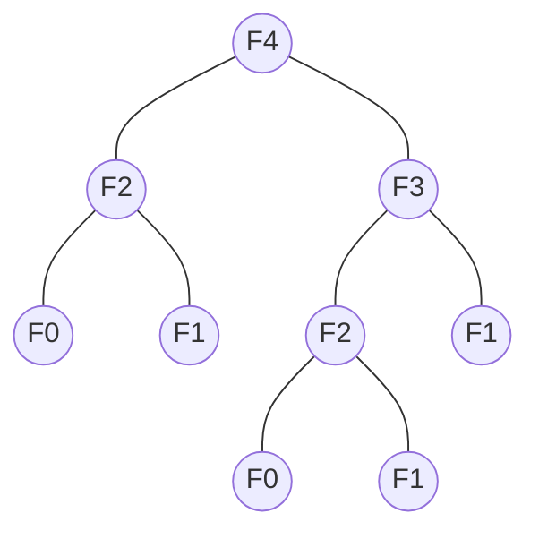

动态规划
=========

动态规划算法通常基于一个递推公式及一个或多个初始状态。 当前子问题的解将由上一次子问题的解推出。使用动态规划来解题只需要多项式时间复杂度， 因此它比回溯法、暴力法等要快许多。

<!-- more -->

动态规划的特点：

+ 把原始问题划分成一系列子问题
+ 求解每个子问题仅仅一次，并将其结果保存在一个表中，以后用到时直接存取，不重复计算，节省计算时间
+ 自底向上地计算

动态规划的适用范围：

+ 一类优化问题：可分为多个相关子问题，子问题的解被重复利用

使用动态规划的条件
------------------

+ 优化子结构
  + 当一个问题的优化解包含了子问题的优化解时,我们说这个问题具有优化子结构。
  + 缩小子问题集合,只需那些优化问题中包含的子问题,降低实现复杂性
  + 优化子结构使得我们能自下而上地完成求解过程
+ 重叠子问题
  + 在问题的求解过程中,很多子问题的解将被多次使用

动态规划算法的设计步骤
---------------------

1. 分析优化解的结构
2. 递归地定义最优解的代价
3. 自底向上地计算优化解的代价保存之,并获取构造最优解的信息
4. 根据构造最优解的信息构造优化解

0-1背包问题
==========

自然语言描述：给定n种物品和一个背包，物品i的体积为$w_i$，价值$v_i$，背包容量为C，问如何选择装入背包的物品，使得装入背包內的物品的总价值最大。

>问题定义：
>输入:$C>0,w_i>0,v_i>0,1 \le i \le n$
>输出:$(x_1,x_2 \dots x_n),x_i \in \{0,1\}$，满足$\sum_{1 \le i \le n}w_ix_i \le C$，$\sum_{1 \le i \le n}v_ix_i$最大。

首先考虑如何描述子问题，子问题的形式和当前问题应当是统一的，这样才能叫做递归子问题。

假设我们把物体排列好了，我们依次选择把物体放进去，这样我们每次面对的问题就是背包的剩余容量和当前要选择的物体是否需要放入的问题。

形式化的描述就是前i个物体的放入剩余容量为j的背包里面的最大价值，而我们所要面对的问题就是，第i个物体是否需要放入到背包中，那么我们就可以定义函数V(i,j)就是前i个物体的放入剩余容量为j的背包里面的最大价值。而我们当前求解的问题就是V(n,C)。

那么问题就可以化为如下递归方程：
$$V(i,j)=\left\{
  \begin{array}{lllr}
  0                                 & j   =   1 & if \quad 0 \le j < w_1   & (1) \\
  v_n                               & j   =   1 & if \quad j \ge w_1       & (2) \\
  V(i-1,j)                          & j \not= 1 & if \quad 0 \le j \le v_i & (3) \\
  \max\{V(i-1,j),V(i-1,j-w_i)+v_i\} & j \not= 1 & if \quad j \ge w_i       & (4)
  \end{array} \right.$$

(1)、(2)是递归基础，(3)、(4)则是递归调用，我们从前往后放物体，后面的这个物体是否放进去依赖于前面物体的价值和背包容量。

习题
====

>$T_1$和$T_2$是两棵有序树，其中每个结点都有一个标签，考虑树上的三种操作，删除一个结点$C_d(t)=d$、插入一个结点$C_i(t)=i$和更改一个结点的标签$C_r(u,v)=\begin{cases}0&u=v\\r&u\not=v\end{cases}$ ，请设计一个算法，求得从$T_1$变化到$T_2$所需要的最少操作数，要求写出递推方程，程序伪代码并分析时间复杂性。

首先定义$\theta(i,j)$，它表示将第一个节点数目为i的树转换成节点数目为j的树所作的最少操作数。

$v,w$是$T_1$或$T_2$的最左节点或最右节点，要么都是最左节点，要么都是最右节点。上标为子树。

$$
\theta(T_1,T_2) = \begin{cases}
  0                                  & T_1=\emptyset      , T_2=\emptyset       \\
  \theta(T_1-v,\emptyset)+C_d(v)     & T_1 \not=\emptyset , T_2=\emptyset       \\
  \theta(\emptyset,T_2-v)+C_i(v)     & T_1=\emptyset      , T_2 \not=\emptyset  \\
  min \begin{cases}
    \theta(T_1-v,T_2) + C_d(v)                                                   \\
    \theta(T_1,T_2-w) + C_i(w)                                                   \\
    \theta(T_1^v-v,T_2^w-w) + \theta(T_1-T_1^v,T_2-T_2^w) + C_r(v,w)
  \end{cases}                        & T_1\not=\emptyset,T_2\not=\emptyset
\end{cases}
$$

>给定三个字符串A, B和C，设计一个多项式时间动态规划算法，求出它们的最长公共子序列，要求写出递归方程，算法伪代码并分析算法复杂性

设$u,v,w$分别是$A,B,C$的最后一个字母。

$$
\theta(A,B,C) = \begin{cases}
  0 & A=\emptyset\ or\ A=\emptyset\ or\ A=\emptyset       \\
  1 + \theta(A-u,B-v,C-w) & u=v=w                         \\
  max \begin{cases}
    \theta(A-u,B,C)                                       \\
    \theta(A,B-v,C)                                       \\
    \theta(A,B,C-w)
  \end{cases}
\end{cases}
$$

>考虑字符串变换操作，增加一个字符，删除一个字符以及修改一个字符，设增加字符操作的代价为i, 删除字符操作代价为d, 修改字符的代价为m，给定两个字符串S1和S2，设计一个动态规划算法，求得从S1变换到S2代价最小的变换序列，要求写出递推方程，程序伪代码并分析算法复杂性。

$$\theta(S_1,S_2) = \begin{cases}
  0                           & S_1=\emptyset\ or\ S_2=\emptyset \\
  \theta(S_1-v,S_2) + d       & S_1\not=\emptyset,S_2=\emptyset \\
  \theta(S_1,S_2-w) + i       & S_1=\emptyset,S_2\not=\emptyset \\
  \max \begin{cases}
    \theta(S_1-v,S_2) + d \\
    \theta(S_1,S_2-w) + i \\
    \theta(S_1-v,S_2-w) + R(v,w) \\
  \end{cases}                 & S_1\not=\emptyset,S_2\not=\emptyset
\end{cases}$$

其中：
$$R(v,w) =\begin{cases}
0  &   v  =  w \\
r  &   v\not=w
\end{cases}$$

>将一根木棒折成若干份，每折一次的代价是当前这段木棒的长度, 总代价是折这根木棒直到满足要求所需要的所有操作的代价。例如，将一根长度为10的木棒折成四段，长度分别为2, 2, 3, 3，如果先折成长度为2和8的两段，再将长度为8的折成长度为2和6的两段，最后将长度为6的折成长度为3的两段，这些操作的代价是10+8+6=24；如果先折成长度为4和6的两段，在分别将长度为4的折成长度为2的两段、长度为6的折成长度为3的两段，则这些操作的代价是10+4+6=20，比上一种方案更好一些。  
>该问题的输入是木棒的长度L和一些整数$c_1,\dots,c_n$, 要求将木棒折成长度为$c_1,\dots,c_n$的n段且操作代价最小，请设计动态规划算法解决该问题。

设$\theta(i,j)$为将$c_i+c_{i+1}+\dots+c_j$长的木棒分开成$c_i,c_{i+1},\dots,c_j$长的小木棒所用的代价。

$$\theta(i,j)=\begin{cases}
  0 & i=j \\
  \min_{i \le k < j}\{\theta(i,k)+\theta(k+1,j)\} + \sum_{i \le k \le j}c_k
\end{cases}
$$

对于$\sum_{i \le k \le j}c_k$，可以使用前缀和的方式来进行优化，令$S_i=\sum_{0 \le k \le j}c_k$，则$\sum_{i \le k \le j}=S_j-S_{i-1}$

> 满足递归式F(n)=F(n-1)+F(n-2)和初始值F(0)=F(1)=1的数列称为斐波那契数列。考虑如何计算该数列的第n项F(n)。  
> 1. 说明根据递归式直接完成计算，将有子问题重复求解  
> 2. 说明该问题具有优化子结构  
> 3. 写出求解F(n)的动态规划算法，并分析算法的时间复杂性



问题1：从上图看很直观，子问题会被重复的求解。

问题2：F(n)=F(n-1)+F(n-2)可以看出，计算F(n)的时候可以拆分成两个子问题来求解，也就具有优化子结构

问题3：

```python
# 递归版本
def fib(n: int) -> int:
    return 1 if n == 0 or n == 1 else fib(n - 1) + fib(n - 2)

# 动态规划版本
def fib(n: int) -> int:
    f = [1] * (n + 1)
    for i in range(2, n + 1):
        f[i] = f[i - 1] + f[i - 2]
    return f[n]

# 迭代版本
def fib(n: int) -> int:
    f, b = 1, 0
    for i in range(n):
        f, b = f + b, f
    return f
```

时间复杂度为$O(n)$。

>输入是具有n个数的向量x，输出是向量x的任何连续子向量的最大和，要求写出递归方程、伪代码并分析时间和空间复杂度。

最大连续子序列和只可能是以位置0~n-1中某个位置结尾。当遍历到第i个元素时，判断在它前面的连续子序列和是否大于0，如果大于0，则以位置i结尾的最大连续子序列和为元素i和前面的的连续子序列和相加；否则，则以位置i结尾的最大连续子序列和为元素i。

设$sum[i]$是$x$中以$x[i]$为结尾的某个序列的和。$$max=\max_{0\le i< n}sum[i]$$
$$
sum[i] = \begin{cases}
  x[i]            & i = 0\ or\ sum[i-1] < 0 \\
  sum[i-1] + x[i] & sum[i-1] \ge 0          \\
\end{cases}
$$

```python
def msb(array: list) -> int:
    s, m = 0, 0
    for i in array:
        s = s + i if s >= 0 else i
        m = s if s > m else m
    return m
```

> 令$I_1,\dots, I_n$是n个区间，其中任一区间$I_i=(a_i,b_i)$，假设这些区间按照$b_i$从小到大排序，每一个区间有一个权重$v_i$。找一个互不相交区间的集合，使得这些区间的权重之和最大。  
> 例如$I_1 = (1,2), v_1=0.9$; $I_2 = (2,3), v_2=0.5$; $I_3 = (1,4), v_3=4$; $I_4 = (4,5)$, $v_4=2$，解是$\{I_3, I_4\}$。  
>给出解决问题P2的动态规划算法，要求写出递归方程和伪代码，并分析算法时间空间复杂性。

可以把这个问题看作是一个背包问题，设$\theta(i,j)$表示$I_1,\dots,I_i$放入$[-\infty,j]$区间內所获得的最大价值

$$\theta(i,j) = \begin{cases}
  0 & j < b_i \\
  \max \begin{cases}
    \theta(i-1,j) \\
    \theta(i-1,a_i) + v_i
  \end{cases} & j \ge b_i
\end{cases}
$$

>在一个圆形操场的四周摆放着n堆石子，现要将石子有次序地合并成一堆。规定每次只能选择相邻的两堆石子合并成新的一堆，并将新一堆石子数记为该次合并的得分。  
>试设计一个动态规划算法，计算出将n堆石子合并成一堆的最小得分和最大得分，要求列出递归方程，写出算法的伪代码并分析算法的时间空间复杂性。

与矩阵链乘类似。
设石子的个数分别为$c_1,c_2,\dots,c_n$。同前面的某道题，sum可以用前缀和优化。

$$\theta(i,j) = \begin{cases}
  0 & i=j \\
  \min_{i\le k< j}(\theta(i,k)+\theta(k+1,j)) + \sum_{i\le k\le j}c_k & i \ne j
\end{cases}
$$

$$\theta(i,j) = \begin{cases}
  0 & i=j \\
  \max_{i\le k< j}(\theta(i,k)+\theta(k+1,j)) + \sum_{i\le k\le j}c_k & i \ne j
\end{cases}
$$

>给定两个字符串$s_1, s_2$，其上的操作包括增加一个字符、删除一个字符、修改一个字符和交换两个相邻的字符，其中增加和删除一个字符和交换相邻字符的代价均为1,将字符a修改为字符b的代价记作C(a,b)，写出一个动态规划算法求出从$s_1$变化为$s_2$代价最小的变化序列，要求写出递推方程和伪代码并分析时间复杂性。

$$\theta(S_1,S_2) = \begin{cases}
  0                           & S_1=\emptyset\ or\ S_2=\emptyset \\
  \theta(S_1-v,S_2) + 1       & S_1\not=\emptyset,S_2=\emptyset \\
  \theta(S_1,S_2-w) + 1       & S_1=\emptyset,S_2\not=\emptyset \\
  \max \begin{cases}
    \theta(S_1-v,S_2) + 1 \\
    \theta(S_1,S_2-w) + 1 \\
    \theta(S_1-v_1v_2+v_2v_1,S_2) + 1 \\
    \theta(S_1-v,S_2-w) + C(v,w) \\
  \end{cases}                 & S_1\not=\emptyset,S_2\not=\emptyset
\end{cases}$$

>设有n种不同面值的硬币，面值分别为$c_1, c_2, \dots, c_n$分钱, 求用最少个数硬币来找K分钱的策略。要求写出递归方程、伪代码并分析时间和空间复杂度。

可以类比背包问题，设$\theta(c,m)$为使用前c种面值的钱币找m分钱。

$$\theta(c,m)=\begin{cases}
  0 & m = 0 \\
  \min_{1\le k\le n}\theta(k,m-c_k) + 1 & m \ne 0
\end{cases}
$$