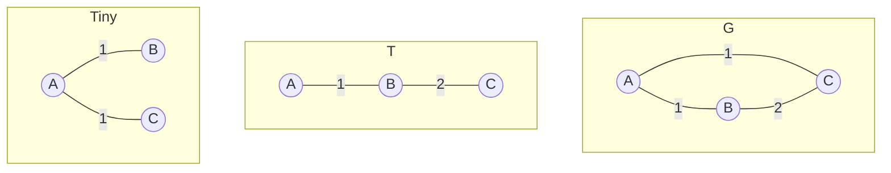

贪心法
=========

基本思想：求解最优化问题的算法包含一系列步骤，每一步都有一组选择，作出在当前看来最好的选择，希望通过作出局部优化选择达到全局优化选择。

<!-- more -->

但事实总不是让人如意：

* 贪心算法不一定总产生优化解
* 贪心算法是否产生优化解需要严格证明

优化条件
=========

>贪心选择性：若一个优化问题的全局优化解可以通过局部优化得到，则该问题成为具有贪心选择性。

<!-- -->

>优化子结构：若一个优化问题的优化解包含它的子问题的优化解，则称其具有优化子结构。

与动态规划的比较
--------------

动态规划方法可用的条件：

* 优化子结构
* 子问题重叠性
* 子问题空间小

贪心法可用的条件：

* 优化子结构
* 贪心选择性

--------------------------------

可用贪心方法时，动态规划方法可能不适用。

可用动态规划方法时，贪心方法可能不适用。

贪心算法正确性证明方法
==================

1. 证明算法所求解的问题具有优化子结构
2. 证明算法所求解的问题具有贪心选择性
3. 证明算法确实按照贪心选择性进行局部优化选择

习题
====

>设有n个物品，第i个物品的价值是$v_i$、重量是$w_i$, 假设物品可以任意分割，给定一个背包，其能容纳最大重量为$C$，求该背包能容纳物品的最大价值。要求写出伪代码并分析算法正确性和复杂性。

解：优先选择单位重量价值最大的物品。

贪心选择性：假设单位重量价值最大的物品不在里面，那么可以将背包里面的物品使用单位重量价值最大的物品替换掉，这样我们就得到了一个比原来价值还大的背包，见鬼了:)，所以，单位重量价值最大的物品一定在里面。

优化子结构：把单位重量价值最大的物品放进去，如果不够，可以切割，如果有空余，那么问题就化为，去掉已经装入物品的剩余物品放入剩余背包容量的子问题。

先排序，再填充，时间$O(n\log n)$。

>有6种硬币，面值是1分, 2分, 5分, 1角，5角，1元，给定一个钱数n，求出一个硬币组合，要求面值总和为n且硬币个数最少，假设每种硬币个数无限。要求写出伪代码并分析算法正确性和时间复杂性。

解：优先选择硬币面额较大的。

贪心选择性：如果面额大的不在里面，那么总可以从里面用面额较小的凑出一个面额较大的来，用面额较大的替换进去，这样硬币数目就比原来更小，这不可能。

优化子结构：如果找回某个硬币，那么就变成总面额减去硬币面额的找硬币问题。

时间复杂度：$O(n)$。

>存放于磁带上文件需要顺序访问。故假设磁带上依次存储了n个长度分别是L[1],….,L[n]的文件，则访问第k个文件的代价为$\sum_{j=1}^kL[j]$。现给定n个文件的长度L[1],….,L[n]，并假设每个文件被访问的概率相等，试设计一个算法输出这n个文件在磁带上的存储顺序使得平均访问代价最小。答案要求包含以下内容：
>
>1. 证明问题具有贪心选择性；
>2. 证明问题具有优化子结构；
>3. 给出算法并分析算法的时间复杂度。

解：优先把长度小的排在前面。

贪心选择性：如果长度最短的不在最前面，那么我们把长度最短的文件$F_1$(设原来位置为第m个，长度最短)抽出，插入到一个位置，那么文件在m之后的不受影响，考虑位置在m之前的文件，他们的访问代价就增加了$Len(F_1)$，而访问文件$F_1$的代价减少了$\sum_{0\le k < m}L[i]$，总代价减少了$\sum_{0\le k < m}(L[i]-Len(F_1))>0$，所以我们得到了一个比原来代价更小的文件序列，这不可能。

优化子结构：设原来的问题为对n个文件求存储顺序，我们把第一个文件确定，原问题就变成了确定剩下的n-1个文件的存储顺序。

```c
#include <stdlib.h>

void qsort(void *base, size_t nmemb, size_t size,
           int (*compar)(const void *, const void *));
```

时间复杂度：$O(n\log n)$

>设有n个正整数，将它们连接成一排，组成一个最大的多位整数。
>例如：n=3时，3个整数13，312，343，连成的最大整数为34331213。
>又如：n=4时，4个整数7，13，4，246，连成的最大整数为7424613。
>输入是n个正整数，输出是这n个正整数连成的最大多位整数，要求用贪心法求解该问题。答案要求包含以下内容：  
>
>1. 证明问题具有贪心选择性；
>2. 证明问题具有优化子结构；
>3. 写出算法伪代码并分析算法的时间复杂度。

解：取首位数字较大的，如果首位数字等长，则依次比较下一位数字，取大的，如果二者不等长，其中一个是另一个的头，则使用长的去掉头字符串的第一位与另一个数字比较。

贪心选择性：如果首位数字最大的不在最前面，那么我们可以进行替换，那么我们就得到了一个与原来等长，但是首位数字更大的数字，这不可能。

优化子结构：将第一个数字确定之后，原问题就变成求剩下的数字连接成的最大多位整数。

时间复杂度：设比较时间是O(1)的，那么排序即可，时间为$O(n\log n)$

>设$x_1, x_2, \dots , x_n$是实数轴上的n个点，若用单位长度的闭区间覆盖这些点，至少需要多少单位长度闭区间？

解：对这些点进行排序，每次将单位长度的闭区间的左起点与剩余点中最左边的点对齐，重复操作即可。

贪心选择性：?留待有缘人?
优化子结构：将第一个区间覆盖了之后，问题就转化成剩下的点用单位长度的闭区间进行覆盖。

时间复杂度：排序$O(n\log n)$

>考虑下述最小生成树算法，初始时，G中的每个顶点被视为一个单结点的树，不选择任何边，在每一步，为每棵树选择一条最小权的边e，是的e只有一个顶点在T中，如果必要的话，出去所选边的备份，当只得到一棵树或者所有边都被选中了，那么终止算法。  
>证明算法的正确性并且求出算法的最大步数。

贪心选择性：假如有顶点临接的边不是权重最小的边，那么我们可以把该顶点临接的权重最小的边加入进去，会形成一个圈，我们把圈上权重最大的边拿掉，这样我们就得到了一个边权和更小的生成树，这不可能。

优化子结构：一旦我们选择了一条边，那么我们可以把这条边临接的两个顶点并为一点，而后在新的剩余边和顶点集中做最小生成树。

时间复杂度：$O(|E|\log|V|)$

>G=(V, E)是一个具有n个顶点m条边的连通图，且可以假设边的代价为正且各不相同，设，定义T的瓶颈边是T中代价最大的边，G的一个生成树T是一棵最小瓶颈生成树，如果不存在G的生成树T’是的它具有代价更小的瓶颈边。
>
>1. G的每棵最小瓶颈树一定是G的一棵生成树吗？证明或者给出反例
>2. G的每棵生成树都是G的最小瓶颈树吗？证明或者给出反例

1. 是，显然G的每棵最小瓶颈树一定是G的一棵生成树
2. 不是



>给定n个自然数$d_1, d_2, \dots, d_n$, 设计算法，在多项式时间确定是否存在一个无向图G，使它的结点度数准确地就是$d_1, d_2, \dots, d_n$， 要求G中在任意两个结点之间至多有一条边，且不存在一个结点到自身的边。

解：将自然数从大到小排序，每次选取最大的，假设为$k$，然后把它移除掉，如果剩下的点的个数大于等于k，那么随机选择k个数字都减1,如果小于0了也移除掉，如果剩下的个数不够k个，那么就无法产生一个符合要求的图。

>考虑一种特殊的0-1背包问题，有n个物品，每个物品价值和重量都相等，背包能容纳的最大重量是C, 回答下列问题:
>若物品的重量(价值)分别是$1, 2,\dots,2^n$, 证明该0-1背包问题可以用贪心法求解并写出该贪心法。  
>请写出一个物品重量(价值)序列，使得上述贪心法无法得到最优解。

解：优先选择重量(价值)最大的物品，

贪心选择性：如果$C=2^i$，那么直接选择重量为$C=2^i$的物品即可，如果$C<2^j$，那么如果能放进去的最大物品重量为$2^k$，那么，所有重量小于$2^k$的物品价值总和$\sum_{0 \le p <k}2^p < 2^k$，那么将其他物品全部取出，换入重量为$2^k$是划算的，那么我们就得到了一个比原来价值更大的背包，这不可能。

优化子结构：普通背包。

物品价值序列：暂无想法

>考虑下述“逆贪心”算法，输入是连通有权无向图G,用邻接表描述

```algorithms
  REVERSEWGREEDYMST(G):
    sort the edges E of G by weight
    for i <- 1 to E
      e <- ith heaviest edge in E
      if G\e is connected
        remove e from G
```

>1. 该算法的最坏运行时间是多少？在什么情况下发生?
>2. 证明这个算法可以找到G的最小生成树。

1. 搜索一次的时间复杂度是$O(|V|+|E|)$，计算最坏运行时间是$O(\frac{3E^2+3V^2}{2}+|E|-|V|-|V||E|)$,最小生成树的边集合是边权最小的那些边，也就是，每一次都要全部搜索完毕。
2. 考虑它的逆过程，就是选择最小边加入。