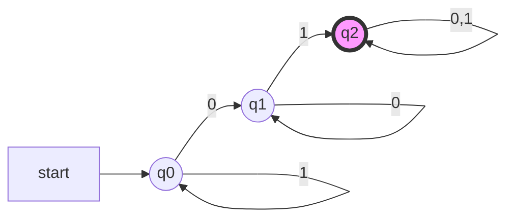
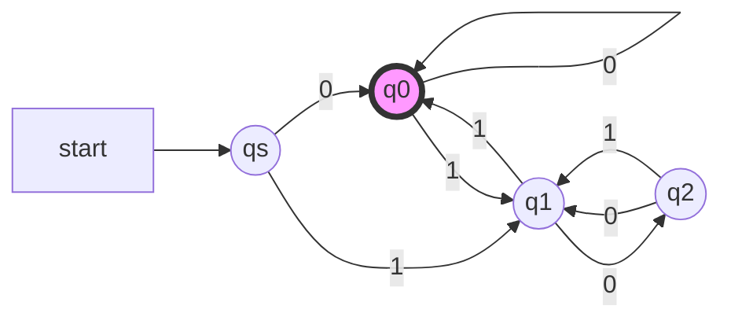
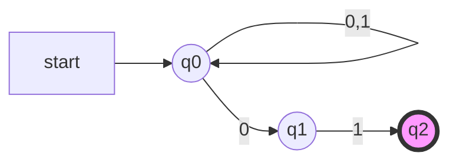
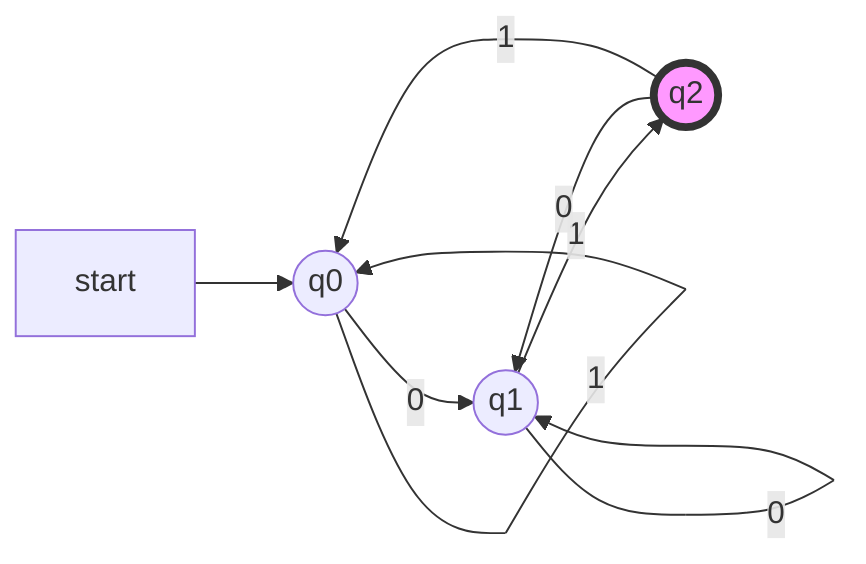

确定的有穷自动机
=============

有穷自动机是具有离散输入和输出系统的一种数学模型。 系统内可以处于任一有穷个内部的格局或称“状态”。 系统的状态概括了关于过去输入的某些信息, 并为确定系统以后的行为所必须。电梯的控制机构, 就是有穷状态系统的一个典型例子。

计算机科学中, 有穷系统的例子有很多, 常见的比如计算机的控制器、词法分析器、协议分析等。

<!-- more -->

DFA形式定义
----------

确定型有穷自动机(Determinstic Finite Automaton,DFA)A的形式定义为五元组：
$$A = (Q,\Sigma,\delta,q_0,F)$$

1. $Q$:有穷状态集
2. $\Sigma$:有穷输入符号集或者字母表
3. $\delta$:$Q \times \Sigma \mapsto Q$,状态转移函数
4. $q_0$:初始状态，$q_0 \in Q$
5. $F$:终结状态集或接受状态集，$F \subseteq Q$

开始时, 输入串在输入带上, 读头在第一个字符, 有穷控制器初始处于 $q_0$ . 自动机的读头每次读入一个字符, 根据转移函数修改当前状态, 并向后移动一个单元格. 若输入串全部读入后, 处于接受状态, 那么自动机接受这个输入串, 否则拒绝该串。

示例

接受全部含有 01 子串的 0 和 1 构成的串。
首先是字母表 $\Sigma = {0, 1}$, 然后分析串的特点: 01 是子串, 则在扫描输入串的过程中需要记住:

1. 当前已经发现 01, 那么串的其余部分不用再关心;
2. 还没发现 01, 但刚刚已经读入了一个 0, 那么只要再读入 1 就符合条件了;
3. 还没发现 01, 甚至 0 都还没出现.

刚好这三种情况可以对应三个状态, 因此$A = (\{q0, q1, q2 \}, \{0, 1\}, δ, q0 , \{q2 \})$
其中 $\delta$:

$$
\begin{matrix}
  δ(q_0,1) = q_0 & δ(q_0,0) = q_1 \\
  δ(q_1,0) = q_1 & δ(q_1,1) = q_2 \\
  δ(q_2,1) = q_2 & δ(q_2,0) = q_2 \\
\end{matrix}
$$

DFA的表示
--------

DFA有两种简化的表示方法，状态转移图(transition diagram)和状态转移表(transition table)

状态转移图的定义:

1. 每个状态对应一个节点, 用圆圈表示
2. 每个 δ(q, a) = p 对应一条从节点 q 到 p 的有向边, 边的标记为 a
3. 开始状态$q_0$有一个标有 start的箭头
4. 接受状态的节点, 用双圆圈表示

状态转移图实例：

状态转移表实例：

|                   | 0     | 1     |
| ----------------: | :---: | :---: |
| $\rightarrow q_0$ | $q_1$ | $q_0$ |
| $q_1$             | $q_1$ | $q_2$ |
| $*q_2$            | $q_2$ | $q_2$ |

DFA扩展转移函数
-------------

转移函数$\delta$是$Q \times \Sigma$上的函数，所以只能处理$\Sigma$中的字符，为了使用方便，定义字符串上的转移函数$\hat{\delta}:Q \times \Sigma^* \mapsto Q$,如下：

1. $\hat{\delta}(q,\epsilon) = q$
2. 若$w = xa$，那么$\hat{\delta}(q,w)=\delta(\hat{\delta}(q,x),a)$，$x$可以为空串$\epsilon$

$\hat{\delta}$的含义可以理解为，从一个状态开始，读入某个串之后，锁到达的状态。

那么，如果$w = a_0a_1 \dots a_n$，那么$\hat{\delta}(q,w)=\delta(\delta(\dots \delta(\hat{\delta}(q,\epsilon),a_0)\dots,a_{n-1}),a_n)$

DFA的语言
--------

DFA $A = (Q,\Sigma,\delta,q_0,F)$接受的语言计为$\mathbf{L}(A)$，定义如下：

$$\mathbf{L}(A) = \{w|\delta(q_0,w) \in F\}$$

如果一个语言是某个DFA $A$的语言，即$L = \mathbf{L}(A)$，则称$L$是正则语言。

示例
---

Design a DFA that accepts all strings w over {0, 1} such that w is the binary representation of a number that is a multiple of 3.

设 $q_0$ , $q_1$ , $q_2$ 分别对应模3为0,1,2的状态;此外,因为不含空串,设开始状态为$q_s$;对 $q_0$,$q_1$,$q_2$每个当前状态,输入0相当于乘2,输入1相当于乘2加1,那么可以找到相应的转移规律。

非确定的有穷自动机
===============

下面给出非确定的有穷自动机的概念. 我们将最终证明, 被非确定的有穷自动机接受的任何集合, 都能够被确定的有穷自动机所接受. 然而, 非确定性概念无论在语言理论还是在计算理论中都起着重要的作用. 在有穷自动机的简单情况下, 透彻的理解这个概念是非常有益的. 后面, 我们将碰到确定形式和非确定形式不等价的自动机, 以及另外一些自动机, 这两种形式的等价性是一个深刻的、重要的悬而未决的问题。

修改 FA 模型, 使之对同一输入符号, 从一个状态可以有零个、一个或多个的转移. 这种新模型,称为非确定有穷自动机。 非确定的有穷自动机具有同时处在几个状态的能力, 在处理输入串时, 几个当前状态能“并行的”跳转到下一个状态。

示例
由 0 和 1 构成的串中, 接受全部以 01 结尾的串。

NFA

DFA

NFA形式定义
----------

非确定型的有穷自动机(Nondeterminstic Finite Automaton,NFA)A的形式定义为五元组：
$$A = (Q,\Sigma,\delta,q_0,F)$$

1. $Q$:有穷状态集
2. $\Sigma$:有穷输入符号集或者字母表
3. $\delta$:$Q \times \Sigma \mapsto 2^Q$,状态转移函数
4. $q_0$:初始状态，$q_0 \in Q$
5. $F$:终结状态集或接受状态集，$F \subseteq Q$

NFA 与 DFA 的区别是转移函数和接受方式: NFA 转移函数一般形式 $\delta(q, a) = \{p_1 , p_2, · · · , p_n \}$;当输入串全部读入时, NFA 所处的状态中, 只要包括 F 中的状态, 就称为接受该串.

示例
前面的例子中, NFA 的定义可以形式化的表述为$A = (\{q_0, q_1, q_2 \}, \{0, 1\}, \delta, q_0 , \{q_2 \})$

其中转移函数$\delta$如下:
$$
\begin{array}
\delta(q_0,0) = \{q_0,q_1\} & \delta(q_1,0) = \emptyset &\delta(q_2,0) = \emptyset \\
\delta(q_0,1) = \{q_0\} & \delta(q_1,1) = \{q_2\} & \delta(q_2,1) = \emptyset
\end{array}
$$

若表示为状态转移表:

|                   | 0             | 1           |
| ----------------: | :-----------: | :---------: |
| $\rightarrow q_0$ | $\{q_0,q_1\}$ | $\{q_0\}$   |
| $q_1$             | $\emptyset$   | $\{q_2\}$   |
| $*q_2$            | $\emptyset$   | $\emptyset$ |

NFA扩展转移函数
-------------

与 DFA 类似,将$\delta$扩展到输入串. 定义转移函数$Q \times \Sigma \mapsto 2^Q$的扩展为

1. $\hat{\delta}(q, \epsilon) = {q}$;
2. 若$w = xa$, 那么$\hat{\delta}(q, w) = \bigcup_{p \in \hat{\delta}(q,x)}\delta(p,a)$

示例
前面的例子中, 若输入是 00101, 每一步的状态转移分别是:

1. $\hat{\delta}(q_0, \epsilon)=\{q_0 \}$
2. $\hat{\delta}(q_0, 0) = \delta(q_0 , 0) = \{q_0 , q_1\}$
3. $\hat{\delta}(q_0, 00) = \delta(q_0 , 0) \cup \delta(q_1, 0) = \{q_0 , q_1 \} \cup \emptyset = \{q_0 , q_1 \}$
4. $\hat{\delta}(q_0, 001) = \delta(q_0 , 1) \cup \delta(q_1, 1) = \{q_0 \} \cup \{q_2\} = \{q_0 , q_2 \}$
5. $\hat{\delta}(q_0, 0010) = \delta(q_0 , 0) \cup \delta(q_2, 0) = \{q_0 , q_1 \} \cup \emptyset = \{q_0 , q_1 \}$
6. $\hat{\delta}(q_0, 00101) = \delta(q_0 , 1) \cup \delta(q_1, 1) = \{q_0 \} \cup \{q_2\} = \{q_0 , q_2 \}$

因为 $q_2$ 是接受状态, 所以 NFA 接受 00101.

NFA的语言
--------

NFA $A = (Q,\Sigma,\delta,q_0,F)$接受的语言计为$\mathbf{L}(A)$，定义如下：

$$\mathbf{L}(A) = \{w|\delta(q_0,w) \cap F \not = \emptyset\}$$

DFA与NFA的等价性
--------------

每个DFA都是一个NFA,显然,NFA接受的语言包含正则语言。下面的定理给出,NFA也仅接受正则语言。证明的关键表明DFA能够模拟NFA,即,对每个NFA,能够构造一个等价的DFA。使用一个DFA模拟一个NFA的方法是让DFA的状态对应于NFA的状态集合。

> 定理 1. 如果语言*L*被某个*NFA*接受, 当且仅当L被某个*DFA*接受。

证明：设 NFA$N =(Q_N,\Sigma,\delta_N,q_0,F_N)$接受L,那么构造 DFA$D=(Q_D,\Sigma,\delta_D,\{q_0\},F_D)$如下:

1. $Q_D = 2^{Q_N}$ , 即 DFA 的状态是 NFA 的状态集;
2. 开始状态 ${q_0}$;
3. 终态 $F_D = \{S | S \subseteq Q_N,S \cap F_N \not = \emptyset \}$, 即包含 NFA 终态的状态集, 作为 DFA 的终态;
4. 状态转移函数 $\delta_D$ , 对每个$S \subseteq Q_N$和每个输入字符:$$\delta_D(S,A) = \bigcup_{p \in S} \delta_N([,a]) $$即$\delta_D(S, a)$的计算, 就是在NFA中, 从S中每个状态p在输入a之后所能达到的全部状态的集合.

下面用归纳法, 证明 $\mathbf{L}(D) = \mathbf{L}(N)$. 对w的长度进行归纳, 往证$$\hat{\delta}_D(\{q_0\},w)=\hat{\delta}_N(q_0,w)$$成立.

[归纳基础] 当$|w| = 0$时, 即$w = \epsilon$时, 显然$\hat{\delta}_D(\{q_0\},\epsilon)=\hat{\delta}_N(q_0,\epsilon)=\{q_0\}$.

[归纳假设] 假设$|w|=n(n \ge 0)$时, 上式成立;

[归纳递推] 那么,当$|w|=n+1$时,将$w$拆分成$w=xa$的形式,$a$是$w$最后一个符号. 由$\hat{\delta}_N$的定义, 有$$\hat{\delta}_N(q_0,w)=\hat{\delta}_N(q_0,xa)=\bigcup_{p \in \hat{\delta}_N(q_0,x)}\delta_N(p,a)$$由$\hat{\delta}_D$的定义, 有$$\hat{\delta}_D(\{q_0\},w)=\hat{\delta}_D(\{q_0\},xa)=\delta_D(\hat{\delta}_D(\{q_0\},x),a)$$由上面的DFA$D$的构造, 有$$\delta_D(\hat{\delta}_D(\{q_0\},x),a)=\bigcup_{p \in \hat{\delta}_N(\{q_0\},x)}\delta_N(p.a)$$又因为, 由归纳假设$$\hat{\delta}_D(\{q_0\},x)=\hat{\delta}_N(q_0,x)$$因此$\hat{\delta}_D(\{q_0\},w)=\hat{\delta}_N(q_0,w)$成立。

因此$\forall w \in \mathbf{L}(N)$, 有$\hat{\delta}_N(q_0,w) \cap F_N \not= \emptyset$, 那么$\hat{\delta}_D(\{q_0\}, w)\in F_D$, 所以$w \in \mathbf{L}(D)$, 即 $\mathbf{L}(N) \subseteq\mathbf{L}(D)$; 且$∀w \in \mathbf{L}(D)$, 有$\hat{\delta}_D(\{q_0\}, w) \in F_D$, 那么 $\hat{\delta}_N(q_0,w)\cap F_N \not= \emptyset$所以 $w \in \mathbf{L}(N)$, 即$\mathbf{L}(D)\subseteq \mathbf{L}(N)$;因此$\mathbf{L}(D)=\mathbf{L}(N)$。

示例(子集构造法，构造与NFA等价的DFA):

|                            | 0             | 1             |
| -------------------------: | :-----------: | :-----------: |
| $\rightarrow \{q_0\}$      | $\{q_0,q_1\}$ | $\{q_0\}$     |
| $\cancel{\{q_1\}}$         | $\emptyset$   | $\{q_2\}$     |
| $\cancel{*\{q_2\}}$        | $\emptyset$   | $\emptyset$   |
| $\{q_0,q_1\}$              | $\{q_0,q_1\}$ | $\{q_0,q_2\}$ |
| $*\{q_0,q_2\}$             | $\{q_0,q_1\}$ | $\{q_0\}$     |
| $\cancel{\emptyset}$       | $\emptyset$   | $\emptyset$   |
| $\cancel{*\{q_1,q_2\}}$    | $\emptyset$   | $\{q_2\}$     |
| $\cancel{\{q_0,q_1,q_2\}}$ | $\{q_0,q_1\}$ | $\{q_0,q_2\}$ |

带有空转移的有穷自动机
==================

为FA增加另一种扩展:在空串$(\epsilon)$发生状态转移.

$\epsilon-NFA$形式定义
---------------------

确定型有穷自动机(Determinstic Finite Automaton,DFA)A的形式定义为五元组：
$$A = (Q,\Sigma,\delta,q_0,F)$$

1. $Q$:有穷状态集
2. $\Sigma$:有穷输入符号集或者字母表
3. $\delta$:$Q \times (\Sigma \cup \{\epsilon\}) \mapsto Q$,状态转移函数
4. $q_0$:初始状态，$q_0 \in Q$
5. $F$:终结状态集或接受状态集，$F \subseteq Q$

与 DFA 相比,$\epsilon-NFA$的主要区别:

1. 自动机处于某状态, 读入某个字符时, 可能有多余一个的转移;
2. 自动机处于某状态, 读入某个字符时, 可能没有转移;
3. 自动机处于某状态, 可能不读入字符, 就进行转移.

$\epsilon$-闭包
-------------

状态q的$\epsilon$-闭包: 从状态 经过全部标记$\epsilon$的边所能到达的所有状态 (以及 q 自身) 的集合。$\epsilon$-闭包的递归定义:

1. 状态$q \in ECLOSE(q)$;
2. $\forall p \in ECLOSE(q)$, 若$r \in \delta(p, \epsilon)$, 则$r \in ECLOSE(q)$.

如果S是状态集, 则定义:$$ECLOSE(S) =\bigcup_{q\in S}ECLOSE(q)$$

$\epsilon-NFA$扩展转移函数
------------------------

(1) $\hat{\delta}(q, \epsilon) = ECLOSE(q)$
(2) 如果$w = xa$, 则必然$a \not= \epsilon$, 因为$\epsilon \notin \Sigma$, 则$$\hat{\delta}(q,w)=ECLOSE(\bigcup_{p \in \hat{\delta}(q,x)}(p,a))$$

$\epsilon-NFA$的语言
-------------------

$\epsilon-NFA$ $A = (Q,\Sigma,\delta,q_0,F)$接受的语言计为$\mathbf{L}(A)$，定义如下：

$$\mathbf{L}(E) = \{w|\hat{\delta}(q_0,w) \cap F \not = \emptyset\}$$