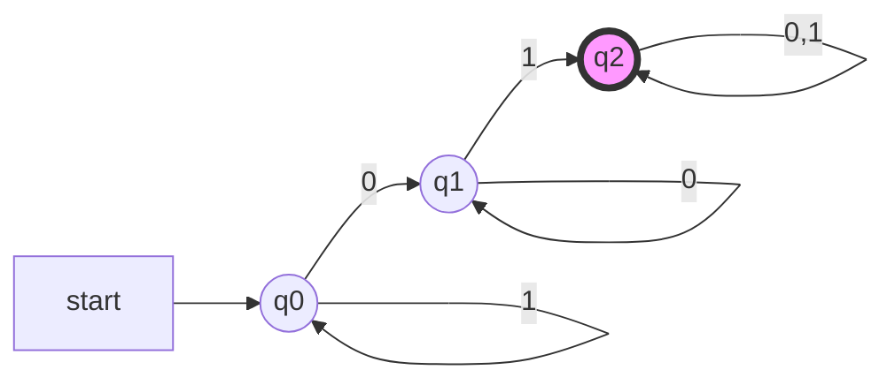
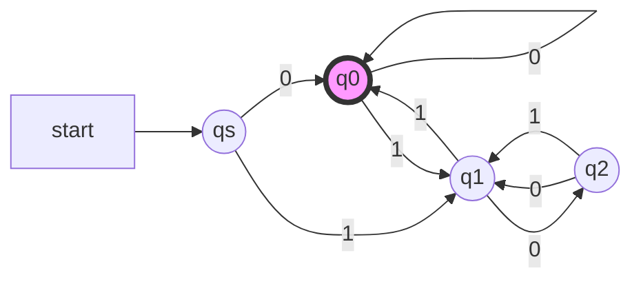
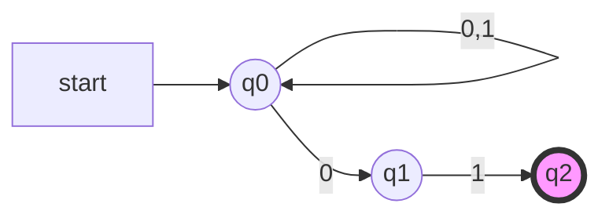
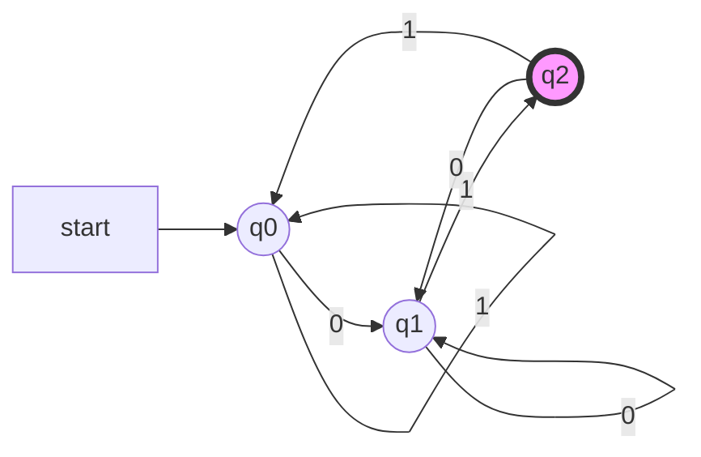

确定的有穷自动机
=============

有穷自动机是具有离散输入和输出系统的一种数学模型。 系统内可以处于任一有穷个内部的格局或称“状态”。 系统的状态概括了关于过去输入的某些信息, 并为确定系统以后的行为所必须。电梯的控制机构, 就是有穷状态系统的一个典型例子。

计算机科学中, 有穷系统的例子有很多, 常见的比如计算机的控制器、词法分析器、协议分析等。

<!-- more -->

形式定义
--------

确定型有穷自动机(Determinstic Finite Automaton,DFA)A的形式定义为五元组：
$$A = (Q,\Sigma,\delta,q_0,F)$$

1. $Q$:有穷状态集
2. $\Sigma$:有穷输入符号集或者字母表
3. $\delta$:$Q \times \Sigma \mapsto Q$,状态转移函数
4. $q_0$:初始状态，$q_0 \in Q$
5. $F$:终结状态集或接受状态集，$F \subseteq Q$

开始时, 输入串在输入带上, 读头在第一个字符, 有穷控制器初始处于 $q_0$ . 自动机的读头每次读入一个字符, 根据转移函数修改当前状态, 并向后移动一个单元格. 若输入串全部读入后, 处于接受状态, 那么自动机接受这个输入串, 否则拒绝该串。

示例

接受全部含有 01 子串的 0 和 1 构成的串。
首先是字母表 $\Sigma = {0, 1}$, 然后分析串的特点: 01 是子串, 则在扫描输入串的过程中需要记住:

1. 当前已经发现 01, 那么串的其余部分不用再关心;
2. 还没发现 01, 但刚刚已经读入了一个 0, 那么只要再读入 1 就符合条件了;
3. 还没发现 01, 甚至 0 都还没出现.

刚好这三种情况可以对应三个状态, 因此$A = (\{q0, q1, q2 \}, \{0, 1\}, δ, q0 , \{q2 \})$
其中 $\delta$:

$$
\begin{matrix}
  δ(q_0,1) = q_0 & δ(q_0,0) = q_1 \\
  δ(q_1,0) = q_1 & δ(q_1,1) = q_2 \\
  δ(q_2,1) = q_2 & δ(q_2,0) = q_2 \\
\end{matrix}
$$

DFA的表示
--------

DFA有两种简化的表示方法，状态转移图(transition diagram)和状态转移表(transition table)

状态转移图的定义:

1. 每个状态对应一个节点, 用圆圈表示
2. 每个 δ(q, a) = p 对应一条从节点 q 到 p 的有向边, 边的标记为 a
3. 开始状态$q_0$有一个标有 start的箭头
4. 接受状态的节点, 用双圆圈表示

状态转移图实例：

状态转移表实例：

|                   | 0     | 1     |
| ----------------: | ----- | ----- |
| $\rightarrow q_0$ | $q_1$ | $q_0$ |
| $q_1$             | $q_1$ | $q_2$ |
| $*q_2$            | $q_2$ | $q_2$ |

扩展转移函数
----------

转移函数$\delta$是$Q \times \Sigma$上的函数，所以只能处理$\Sigma$中的字符，为了使用方便，定义字符串上的转移函数$\hat{\delta}:Q \times \Sigma^* \mapsto Q$,如下：

1. $\hat{\delta}(q,\epsilon) = q$
2. 若$w = xa$，那么$\hat{\delta}(q,w)=\delta(\hat{\delta}(q,x),a)$，$x$可以为空串$\epsilon$

$\hat{\delta}$的含义可以理解为，从一个状态开始，读入某个串之后，锁到达的状态。

那么，如果$w = a_0a_1 \dots a_n$，那么$\hat{\delta}(q,w)=\delta(\delta(\dots \delta(\hat{\delta}(q,\epsilon),a_0)\dots,a_{n-1}),a_n)$

DFA的语言
========

DFA $A = (Q,\Sigma,\delta,q_0,F)$接受的语言计为$\mathbf{L}(A)$，定义如下：

$$\mathbf{L}(A) = \{w|\delta(q_0,w) \in F\}$$

如果一个语言是某个DFA $A$的语言，即$L = \mathbf{L}(A)$，则称$L$是正则语言。

示例
---

Design a DFA that accepts all strings w over {0, 1} such that w is the binary representation of a number that is a multiple of 3.

设 $q_0$ , $q_1$ , $q_2$ 分别对应模3为0,1,2的状态;此外,因为不含空串,设开始状态为$q_s$;对 $q_0$,$q_1$,$q_2$每个当前状态,输入0相当于乘2,输入1相当于乘2加1,那么可以找到相应的转移规律。

非确定的有穷自动机
===============

下面给出非确定的有穷自动机的概念. 我们将最终证明, 被非确定的有穷自动机接受的任何集合, 都能够被确定的有穷自动机所接受. 然而, 非确定性概念无论在语言理论还是在计算理论中都起着重要的作用. 在有穷自动机的简单情况下, 透彻的理解这个概念是非常有益的. 后面, 我们将碰到确定形式和非确定形式不等价的自动机, 以及另外一些自动机, 这两种形式的等价性是一个深刻的、重要的悬而未决的问题。

修改 FA 模型, 使之对同一输入符号, 从一个状态可以有零个、一个或多个的转移. 这种新模型,称为非确定有穷自动机。 非确定的有穷自动机具有同时处在几个状态的能力, 在处理输入串时, 几个当前状态能“并行的”跳转到下一个状态。

示例
由 0 和 1 构成的串中, 接受全部以 01 结尾的串。

NFA

DFA

