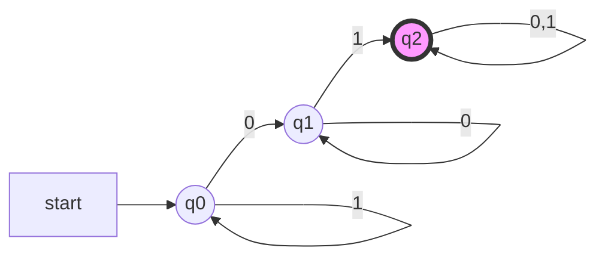

# 确定的有穷自动机

## 形式定义

确定型有穷自动机(Determinstic Finite Automaton,DFA)A的形式定义为五元组：
$$A = (Q,\Sigma,\delta,q_0,F)$$

1. Q:有穷状态集
2. $\Sigma$:有穷输入符号集或者字母表
3. $\delta$:$Q \times \Sigma \rightarrow Q$,状态转移函数
4. $q_0$:初始状态，$q_0 \in Q$
5. $F$:终结状态集或接受状态集，$F \subseteq Q$

<!-- more -->

## DFA的表示

DFA有两种简化的表示方法，状态转移图(transition diagram)和状态转移表(transition table)

状态转移图的定义:

1. 每个状态对应一个节点, 用圆圈表示
2. 每个 δ(q, a) = p 对应一条从节点 q 到 p 的有向边, 边的标记为 a
3. 开始状态$q_0$有一个标有 start的箭头
4. 接受状态的节点, 用双圆圈表示

状态转移图实例：

状态转移表实例：
