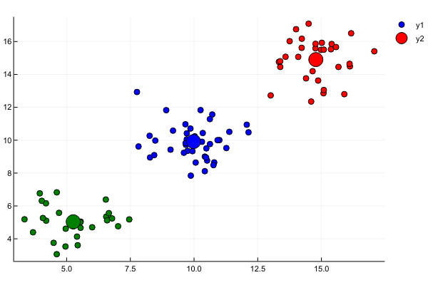
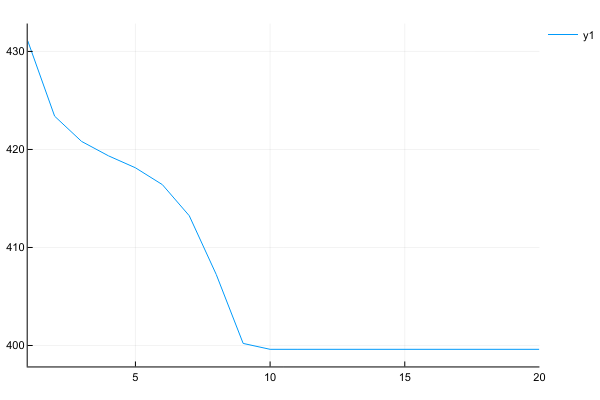

# GMM模型

混合模型是一个可以用来表示在总体分布（distribution）中含有 K 个子分布的概率模型，换句话说，混合模型表示了观测数据在总体中的概率分布，它是一个由 K 个子分布组成的混合分布。混合模型不要求观测数据提供关于子分布的信息，来计算观测数据在总体分布中的概率。
<!-- more -->

# 高斯分布与多元高斯分布

接下来看下严格的高斯公式定义，高斯分布的概率密度函数公式如下：

$$f(x|μ,σ^2) = \frac{1}{\sqrt{2σ^2π}}e^{-\frac{(x-μ)^2}{2σ^2}}$$

高斯混合模型可以看作是由 K 个单高斯模型组合而成的模型，这 K 个子模型是混合模型的隐变量（Hidden variable）。一般来说，一个混合模型可以使用任何概率分布，这里使用高斯混合模型是因为高斯分布具备很好的数学性质以及良好的计算性能。

$$p(x) = ∑^k_{i=1}ϕ_i\frac{1}{\sqrt{wσ_i^2π}}e^{-\frac{(x-μ_i)^2}{2σ_i^2}}$$

向量化之后我们得到的公式如下：

$$p(x) = \frac{1}{(2π)^{\frac{D}{2}|Σ|^\frac{1}{2}}}e^{-\frac{\mathbf{(X-μ)^TΣ^{-1}(X-μ)}}{2}}$$

其中， μ为数据均值（期望），Σ为协方差（Covariance），D为数据维度。

# GMM模型定义

首先定义如下信息：

+ $x_{j}$ 表示第 $j$ 个观测数据， $j = 1,2,...,N$
+ $K$ 是混合模型中子高斯模型的数量， $k = 1,2,...,K$
+ $\alpha_{k}$ 是观测数据属于第 $k$ 个子模型的概率， $\alpha_{k} \geq 0$ ， $\sum_{k=1}^{K}{\alpha_{k}} = 1$
+ $\phi(x|\theta_{k})$ 是第 $k$ 个子模型的高斯分布密度函数， $\theta_{k} = (\mu_{k}$, $\sigma_{k}^{2})$ 。其展开形式与上面介绍的单高斯模型相同
+ $\gamma_{jk}$ 表示第 $j$ 个观测数据属于第 $k$ 个子模型的概率

高斯混合模型的概率分布为：
$$P(x|\theta) = \sum_{k=1}^{K}{\alpha_{k}\phi(x|\theta_{k})}$$

对于这个模型而言，参数 $\theta = (\tilde{\mu_{k}}$, $\tilde{\sigma_{k}}$, $\tilde{\alpha_{k}})$ ，也就是每个子模型的期望、方差（或协方差）、在混合模型中发生的概率。

# 模型参数优化

对于单高斯模型，我们可以用最大似然法（Maximum likelihood）估算参数 \theta 的值，

$$\theta = argmax_{\theta} L(\theta)$$

这里我们假设了每个数据点都是独立的（Independent），似然函数由概率密度函数（PDF）给出。

$$L(\theta) = \prod_{j=1}^{N}P(x_{j}|\theta)$$

由于每个点发生的概率都很小，乘积会变得极其小，不利于计算和观察，因此通常我们用 Maximum Log-Likelihood 来计算（因为 Log 函数具备单调性，不会改变极值的位置，同时在 0-1 之间输入值很小的变化可以引起输出值相对较大的变动）：

$$logL(\theta) = \sum_{j=1}^{N}{logP(x_{j}|\theta)}$$

<!-- [^GMM-Loss]: 我这里将Log-Likelihood取了负值 -->

对于高斯混合模型，Log-Likelihood 函数是：

$$logL(\theta) = \sum_{j=1}^{N}{logP(x_{j}|\theta)} = \sum_{j=1}^{N}{log(\sum_{k=1}^{K}{\alpha_{k}\phi(x|\theta_{k})})}$$

如何计算高斯混合模型的参数呢？这里我们无法像单高斯模型那样使用最大似然法来求导求得使 likelihood 最大的参数，因为对于每个观测数据点来说，事先并不知道它是属于哪个子分布的（hidden variable），因此 $log$ 里面还有求和， $K$ 个高斯模型的和不是一个高斯模型，对于每个子模型都有未知的 $\alpha_{k}$, $\mu_{k}$, $\sigma_{k}$ ，直接求导无法计算。需要通过迭代的方法求解。

# 用于高斯模型的EM算法

EM 算法是一种迭代算法，1977 年由 Dempster 等人总结提出，用于含有隐变量（Hidden variable）的概率模型参数的最大似然估计。

每次迭代包含两个步骤：

+ E-step：求期望 $E(\gamma_{jk} | X, \theta) for all j = 1,2,...,N$
+ M-step：求极大，计算新一轮迭代的模型参数

这里不具体介绍一般性的 EM 算法（通过 Jensen 不等式得出似然函数的下界 Lower bound，通过极大化下界做到极大化似然函数），只介绍怎么在高斯混合模型里应用从来推算出模型参数。

通过 EM 迭代更新高斯混合模型参数的方法（我们有样本数据 $x_{1}, x_{2}, ...,x_{N}$ 和一个有 $K$ 个子模型的高斯混合模型，想要推算出这个高斯混合模型的最佳参数）：

首先初始化参数

+ E-step：依据当前参数，计算每个数据 j 来自子模型 k 的可能性
  + $\gamma_{jk} = \frac{\alpha_{k}\phi(x_{j}|\theta_{k})}{\sum_{k=1}^{K}{\alpha_{k}\phi(x_{j}|\theta_{k})}}, j = 1,2,...,N; k = 1,2,...,K$
+ M-step：计算新一轮迭代的模型参数
  + $\mu_{k} = \frac{\sum_{j}^{N}{(\gamma_{jk}}x_{j})}{\sum_{j}^{N}{\gamma_{jk}}}, k=1,2,...,K$
  + $\Sigma_{k} = \frac{\sum_{j}^{N}{\gamma_{jk}}(x_{j}-\mu_{k})(x_{j}-\mu_{k})^{T}}{\sum_{j}^{N}{\gamma_{jk}}}, k = 1,2,...,K$ （用这一轮更新后的 $\mu_{k}$ ）
  + $\alpha_{k} = \frac{\sum_{j=1}^{N}{\gamma_{jk}}}{N}, k=1,2,...,K$

重复计算 E-step 和 M-step 直至收敛 （ $||\theta_{i+1} - \theta_{i}|| < \varepsilon$ , $\varepsilon$ 是一个很小的正数，表示经过一次迭代之后参数变化非常小）

至此，我们就找到了高斯混合模型的参数。需要注意的是，EM 算法具备收敛性，但并不保证找到全局最大值，有可能找到局部最大值。解决方法是初始化几次不同的参数进行迭代，取结果最好的那次。