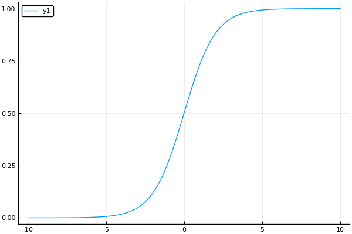

# 逻辑回归

Logistic Regression虽然名字里带“回归”，但是它实际上是一种分类方法，用于两分类问题（即输出只有两种）。根据第二章中的步骤，需要先找到一个预测函数（h），显然，该函数的输出必须是两个值（分别代表两个类别），所以利用了Logistic函数（或称为Sigmoid函数），函数形式为：

<!-- more -->

$$sigmoid(z) = \frac{1}{1 + e^{-z}}$$

# 逻辑回归的优缺点

优点：

1. 速度快，适合二分类问题
2. 简单易于理解，直接看到各个特征的权重
3. 能容易地更新模型吸收新的数据

缺点：
对数据和场景的适应能力有局限性，不如决策树算法适应性那么强

# 逻辑回归和多重线性回归的区别

Logistic回归与多重线性回归实际上有很多相同之处，最大的区别就在于它们的因变量不同，其他的基本都差不多。正是因为如此，这两种回归可以归于同一个家族，即广义线性模型（generalizedlinear model）。 
这一家族中的模型形式基本上都差不多，不同的就是因变量不同。这一家族中的模型形式基本上都差不多，不同的就是因变量不同。

+ 如果是连续的，就是多重线性回归
+ 如果是二项分布，就是Logistic回归
+ 如果是Poisson分布，就是Poisson回归
+ 如果是负二项分布，就是负二项回归

# 逻辑回归用途

+ 寻找危险因素：寻找某一疾病的危险因素等；
+ 预测：根据模型，预测在不同的自变量情况下，发生某病或某种情况的概率有多大；
+ 判别：实际上跟预测有些类似，也是根据模型，判断某人属于某病或属于某种情况的概率有多大，也就是看一下这个人有多大的可能性是属于某病。

# Regression 常规步骤

+ 寻找h函数（即预测函数）
+ 构造J函数（损失函数）
+ 想办法使得J函数最小并求得回归参数（θ）

# 构造预测函数h(x)

$$\begin{array}{ll}
h_θ(x) &= sigmoid(-θ^TX)  \\
       &= \frac{1}{1 + e^{-θ^TX}}
\end{array}$$

函数h(x)的值有特殊的含义，它表示结果取1的概率，因此对于输入x分类结果为类别1和类别0的概率分别为：

$$P(y=1│x;θ)=h_θ (x)$$
$$P(y=0│x;θ)=1-h_θ(x)$$

# 构造损失函数J

由于我们知道y只能取0或者1,我们可以把概率写成如下形式：

$$P(y|x;θ) = (h_θ(x))^y(1-h_θ(x))^{1-y}$$

取似然对数为：

$$L(θ)=\prod_{i=1}^{m} {(h_{θ}(x^{(i)}))^{y_i}} *{(1-h_{θ}(x^{(i)}))^{1-y_i}}$$

取对数似然有：
$$l(θ)=log(L(θ))=\sum_{i=1}^{m}\log({(h_{θ}(x^{(i)}))^{y_i}}) + \log({(1-h_{θ}(x^{(i)}))^{1-y_i}})$$

$$l(θ)=log(L(θ))=\sum_{i=1}^{m} {y_i}log{(h_{θ}(x^{(i)}))} + ({1-y_i})log{(1-h_{θ}(x^{(i)}))}$$

# 梯度下降法

求导：

$$\begin{array}{ll}
\frac{∂l}{∂θ_j} &=  ∑^m_{i=1}(y_i \frac{1}{h_θ(x^{(i)})} \frac{∂h_θ}{∂θ_j} -(1-y_i)\frac{1}{1-h_θ(x^{(i)})}\frac{∂h_θ}{∂θ_j}) \\
&= ∑^m_{i=1}(y_i \frac{1}{g(θ^Tx^{(i)})} - (1-y_i)\frac{1}{1 - g(θ^Tx^{(i)})})\frac{∂g(θ^Tx^{(i)})}{∂θ_j} \\
&= ∑^m_{i=1}(y_i \frac{1}{g(θ^Tx^{(i)})} - (1-y_i)\frac{1}{1 - g(θ^Tx^{(i)})})g(θ^Tx^{(i)})(1-g(θ^Tx^{(i)}))\frac{θ^Tx^{(i)}}{∂θ
_j} \\
&= ∑^m_{i=1}(y_i(1-g(θ^Tx^{(i)})) - (1-y_i)g(θ^Tx^{(i)}))x^{(i)}_j \\
&= ∑^m_{i=1}(y_i-g(θ^Tx^{(i)}))x^{(i)}_j \\
&= ∑^m_{i=1}(y_i - h_θ(x^{(i)}))x^{(i)}_j
\end{array}$$

$$θ_j = θ_j - α \frac{1}{m}∑^m_{i=1}(h_θ(x^{(i)})-y_i)x^{(i)}_j$$

# 牛顿法

考虑牛顿法在求解方程$f(θ)=0$时的用法。牛顿法在求解方程根时，主要是根据泰勒展示式进行迭代求解的。 假设 $f(x)=0$ 有近似根$x_k$，那么 $f(x)$ 在点 $x_k$ 处的泰勒展开式表示为，

$$f(x) \approx f(x_k) + f'(x_k)(x-x_k)$$

令$f(x)=0$有，$f(x_k)+f′(x_k)(x−x_k)=0$，求解得到$x_{k+1}$

$$x_{k+1}=x_{k}-\frac{f(x_k)}{f'(x_k)}$$

类似的，我们求解$θ$

$$θ = θ - \frac{l'(θ)}{l''(θ)}$$

$$\frac{∂}{∂ θ_i}l(θ)=\sum_{t=1}^m(y^{(t)}-h_θ(x^{(t)}))x_i^{(t)}$$

$$\begin{array}{ll}
H_{ij}
&=\frac{∂^2l(θ)}{∂θ_i∂θ_j}\\
&=\frac{∂}{θ_j}\sum_{t=1}^m(y^{(t)}-h_θ(x^{(t)}))x_i^{(t)}\\
&=\sum_{t=1}^m \frac{∂}{θ_j} (y^{(t)}-h_θ(x^{(t)}))x_i^{(t)}\\
&=\sum_{t=1}^m -x_i^{(t)} \frac{∂ }{∂ θ_j}h_θ(x^{(t)})\\
&=\sum_{t=1}^m -x_i^{(t)} h_θ(x^{(i)}) (1-h_θ(x^{(i)})) \frac{∂}{θ_j}(θ^Tx^{(t)} )\\
&=\sum_{t=1}^m h_θ(x^{(t)})(h_θ(x^{(t)})-1)x^{(t)}_ix^{(t)}_j\\
\end{array}$$

# 向量化

$$X = \begin{bmatrix}
   x^{(1)} \\
   ⋮  \\
   x^{(m)}
\end{bmatrix} = \begin{bmatrix}
   x_{11} & \dots & x_{1n}  \\
   ⋮     &       &   ⋮     \\
   x_{m1} & \dots & x_{mn}
\end{bmatrix}
Y = \begin{bmatrix}
   y_1 \\
   ⋮  \\
   y_m
\end{bmatrix}
θ = \begin{bmatrix}
   θ_1 \\
   ⋮  \\
   θ_n
\end{bmatrix}$$

$$\hat{Y} = X θ = \begin{bmatrix}
   x_{11} & \dots & x_{1n}  \\
   ⋮     &       &   ⋮     \\
   x_{m1} & \dots & x_{mn}
\end{bmatrix} \begin{bmatrix}
   θ_1 \\
   ⋮  \\
   θ_n
\end{bmatrix} = \begin{bmatrix}
   θ_1x_{11} & \dots & θ_nx_{1n}  \\
   ⋮     &       &   ⋮     \\
   θ_1x_{m1} & \dots & θ_nx_{mn}
\end{bmatrix}
$$

$$E = h_θ(X) - Y = \begin{bmatrix}
h_θ(x^{(1)})-y_1\\
⋮\\
h_θ(x^{(m)}) - y_m
\end{bmatrix}$$

$$θ = θ - αX^TE$$

----------------------------------------

$$A=\begin{bmatrix}
h_θ(x^{(1)})\cdot [h_θ(x^{(1)})-1]  &  0   &  \cdots  &  0 \\
0       & h_θ(x^{(2)})\cdot [h_θ(x^{(2)})-1]&\cdots&0 \\
\vdots  & \vdots & \ddots & \vdots\\
0       &    0   & \cdots & h_θ(x^{(m)})\cdot [h_θ(x^{(m)})-1] \\
\end{bmatrix}$$

$$U = - X^T E=  \begin{bmatrix}
x_{11} & x_{21} & \cdots&x_{m1}\\
x_{12} & x_{22} & \cdots&x_{m2}\\
\vdots & \vdots & \ddots &\vdots \\
x_{1n}&x_{2n}&\cdots&x_{mn}
\end{bmatrix}
\begin{bmatrix}
y_1 - h_θ(x^{(1)})\\
y_2 - h_θ(x^{(2)})\\
\vdots\\
y_m - h_θ(x^{(m)})\\
\end{bmatrix}$$

$$H = X^T A X$$

$$θ_{new}=θ_{old}-\frac{U}{H}=θ_{old}-{H}^{-1}{U}$$